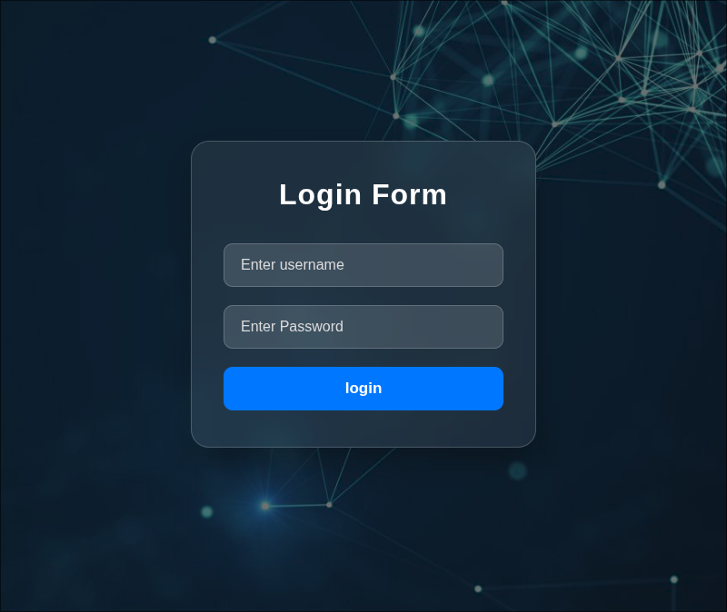
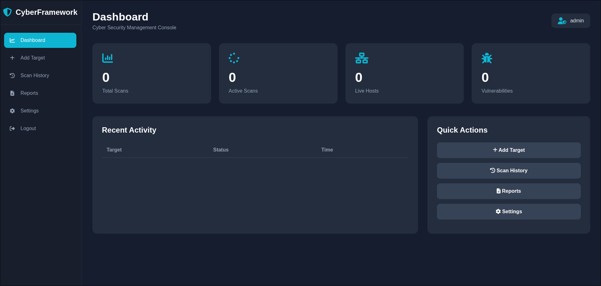
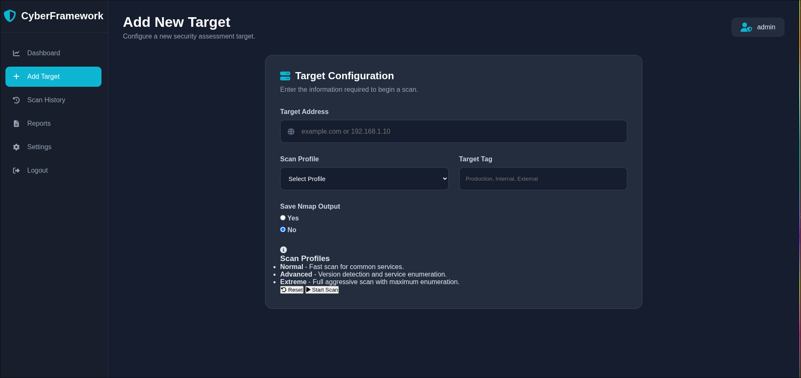
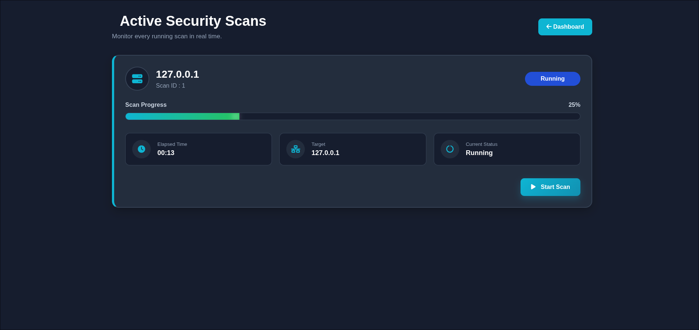
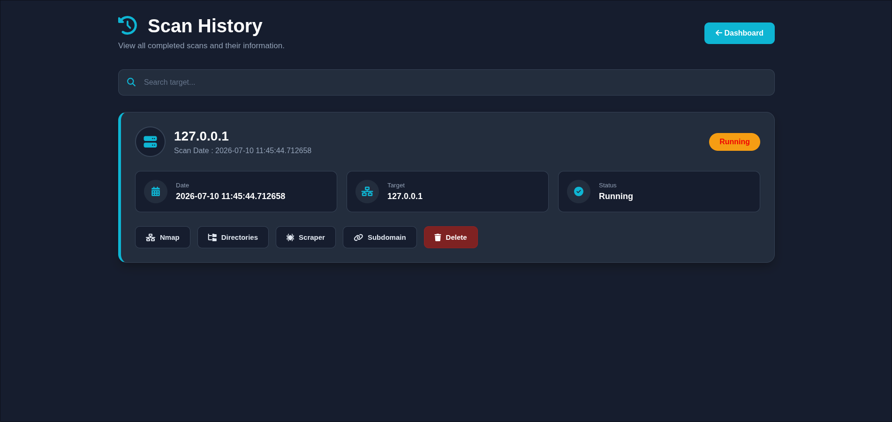

# Cyber Framework

A modular web-based penetration testing and reconnaissance framework built with **Python** and **Flask**. The framework is designed to automate common reconnaissance tasks through an intuitive web dashboard while securely managing users, scan targets, and scan history.

> **Disclaimer:** This project is intended for **authorized penetration testing, security research, and educational purposes only.** Only use it against systems you own or have explicit permission to assess.

---

## Features

### Authentication

* User Registration
* Secure Login
* Multi-Factor Authentication (MFA)

### Dashboard

* User-specific Dashboard
* Add and Manage Targets
* Individual Target History
* Scan Queue
* Scan Progress Tracking

### Reconnaissance Modules

* Nmap Port Scanning
* DNS Enumeration
* Subdomain Enumeration
* Directory Discovery
* Live Webpage Detection
* Website Scraping
* Automatic Screenshot Capture of Discovered Pages

### Data Management

* SQLAlchemy Database
* Scan History
* User Management
* Persistent Scan Results

---

## Upcoming Features

* AI-Assisted Vulnerability Analysis
* Automated Risk Classification
* HTML & PDF Report Generation
* CVE Correlation
* Plugin-Based Scan Modules
* REST API
* Advanced Dashboard Analytics

---

## Technology Stack

### Backend

* Python
* Flask
* SQLAlchemy

### Frontend

* HTML
* CSS
* JavaScript

### Database

* SQLite

### Security

* MFA Authentication
* Password Hashing
* Session Management

### Recon Tools

* Nmap
* DNS Enumeration
* Custom Recon Modules

---

## Project Structure

```text
Cyber_Framework/
│
├── Modules/
├── static/
├── templates/
├── logs/
├── app.py
├── Encryption/
├── requirements.txt
├── README.md
└── .gitignore
```

---

## Installation

Clone the repository:

```bash
git clone https://github.com/YOUR_USERNAME/Cyber-Framework.git
cd Cyber-Framework
```

Create a virtual environment:

```bash
python -m venv venv
```

Activate the virtual environment.

Linux/macOS:

```bash
source venv/bin/activate
```

Windows:

```cmd
venv\Scripts\activate
```

Install dependencies:

```bash
pip install -r requirements.txt
```

Run the application:

```bash
python app.py
```

Open your browser:

```
http://127.0.0.1:5000
```

---

## Workflow

1. Register an account
2. Log in
3. Configure Multi-Factor Authentication
4. Add one or more targets
5. Start reconnaissance scans
6. Monitor scan progress
7. Review scan history
8. Analyze collected information

---

## Screenshots

Add screenshots here before publishing:

## Login



## Dashboard



## Target Management



## Scan Progress



## Scan Results



---

## Future Roadmap

* AI-powered vulnerability analysis
* Automated reporting (HTML/PDF)
* Technology fingerprinting
* CVE matching
* Plugin architecture
* Scan comparison
* Docker deployment
* REST API
* Multi-user collaboration

---

## Learning Objectives

This project was developed to strengthen practical skills in:

* Python Development
* Flask Web Applications
* SQLAlchemy ORM
* Authentication & MFA
* Network Reconnaissance
* Web Security
* Secure Software Design
* Cybersecurity Automation
